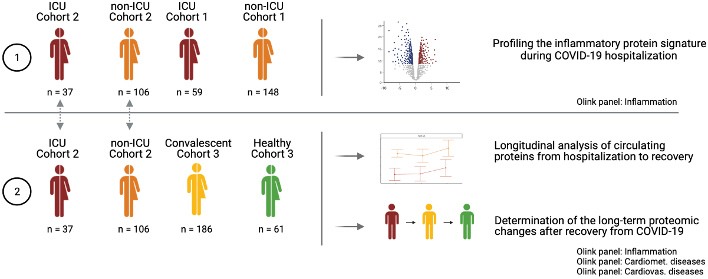

# Postcovid targeted proteomics
Contains all data and scripts used in the targeted proteomic post-COVID-19 study (doi: ). In short, we performed targeted proteomics analysis using the Olink platform and systematically investigated circulating protein levels from 627 COVID-19 hospitalized patients, 186 COVID-19 convalescent individuals and 61 healthy individuals separated into 3 independent cohorts. All the raw data and scripts used to analyse this data are available in this repository.

#### Directories:
<ul>
<li><strong>Data</strong>: Raw data</li>
<li><strong>R</strong>: R scripts used for analysis and to generate all figures</li>
<li><strong>input prediction models</strong>: Example CSV files to be used as input for the prediction models described in the paper</li>

</ul>

#### Study overview:

#### Contact
Author: Martijn Zoodsma, Helmholtz Centre for Infection Research.  
Principal Investigator: Prof. Dr. Yang Li.  
email: martijn.zoodsma@helmholtz-hzi.de

